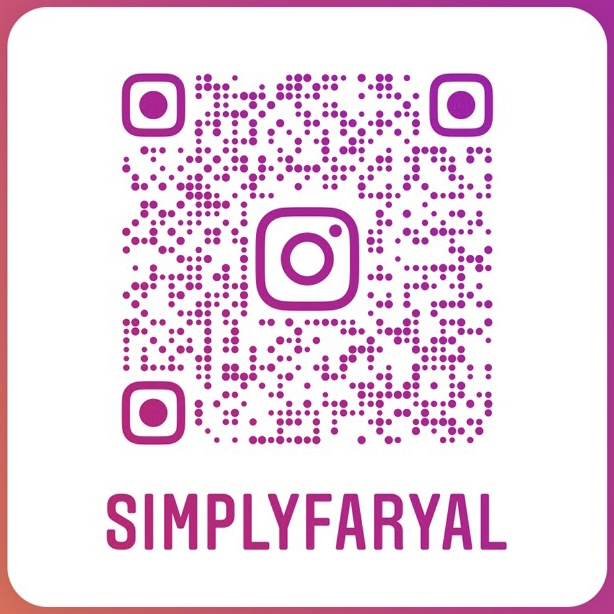

***

## Hi! My name is in the banner. To pronounce it, it's like you are going "far" with the southern "y'all".

- 🔭 I’m currently working on InteriorCafé
- 🌱 I’m currently learning JavaScript 
- 👯 I’m looking to collaborate on ... we will see about that
- 🤔 I’m looking for help with error handling
- 💬 Ask me about anything! I like talking
- 😄 Pronouns: She/Her
- ⚡ Fun fact: I like coffee and IronMan 

***

# Projects Demo

***

# GitHub Stats

***

# The Good Stuff...Tech I Know

 

  

 

 

 

 

 

 

***

# Need a Friend in the tech World? Let's Connect!
<a href="https://www.instagram.com/simplyfaryal/"> 

#

<a href="https://www.linkedin.com/in/faryalansari/">

#

